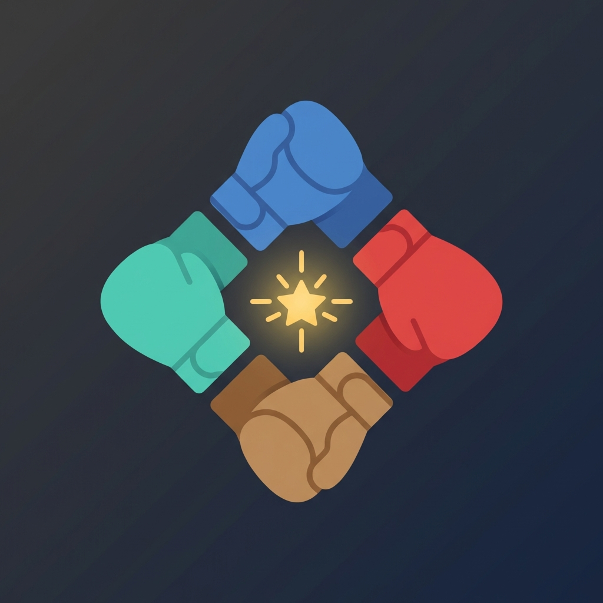

<p align="center">
  
</p>

<h1 align="center">SPAR-Kit</h1>

<p align="center">
  <strong>Structured Persona-Argumentation for Reasoning</strong><br>
  <em>A methodology for stress-testing decisions through structured disagreement.</em>
</p>

<p align="center">
  <a href="https://www.npmjs.com/package/sparkit"></a>
  <a href="LICENSE"></a>
  <a href="https://synthanai.github.io/spar-kit"></a>
  
</p>

<p align="center">
  <strong>நாலு பேரு, நாலு திசை, ஒரு முடிவு!</strong><br>
  <em>Four Perspectives, Four Dimensions, One Synthesis</em>
</p>

---

## What is SPAR?

**SPAR** is a decision-making methodology that uses structured disagreement between distinct personas to surface insights that consensus-seeking processes systematically miss. Whether those personas are embodied by humans, simulated by AI, or both — the methodology remains the same.

| Letter | Meaning | Definition |
|--------|---------|------------|
| **S** | Structured | Not ad-hoc; a designed process with protocols and phases |
| **P** | Persona | Distinct voices with coherent, conflicting worldviews |
| **A** | Argumentation | Personas debate and defend positions — not just "provide perspectives" |
| **R** | Reasoning | Systematic logic that exposes blind spots and triggers System 2 thinking |

---

## The Problem

**Don't Deliberate Alone.**

The problem isn't AI. The problem is **isolated reasoning** — and it fails in every context:

| Context | The Problem |
|---------|-------------|
| **Leader alone** | Personal blind spots, confirmation bias, echo chamber of self |
| **Team together** | Groupthink, shared assumptions, hierarchy silencing dissent |
| **Person + AI** | Single reasoning context producing false "balance" |
| **AI alone** | Sophisticated coherence without genuine tension |

When you deliberate alone — whether that's a lone executive, a homogeneous team, or a single AI context — you get *variations on a theme*, not genuine disagreement.

**This is not debate. This is sophisticated confirmation bias.**

## The Solution

SPAR creates **genuine tension** by instantiating personas with coherent, conflicting worldviews that *actually disagree*. The result is not a balanced trade-off list. It's a dialectic that surfaces what you'd never see alone.

> *"One methodology. Five modes. Every decision."*  
> *"Don't deliberate alone. SPAR."*

---

## Installation

### One-Line Install (Recommended)

```bash
curl -fsSL https://raw.githubusercontent.com/synthanai/spar-kit/main/install.sh | sh
```

This installs the CLI **and** auto-configures integrations for:
- 🤖 **Claude Code** — Adds skill to `~/.claude/skills/`
- ✨ **Gemini** — Adds skill + workflow to `.agent/`
- 🎯 **Cursor** — Adds rules to `~/.cursor/`

### Web (No Install)
**[▶️ synthanai.github.io/spar-kit](https://synthanai.github.io/spar-kit)**

### ChatGPT GPT (No Install)
**[🤖 SPAR Decision Partner](https://chatgpt.com/g/g-69678df7ed248191be8fd211e11d4797)** — Use SPAR directly in ChatGPT

### npm Only
```bash
npm install -g sparkit
```

---

## Usage

```bash
# 🎯 Launch TUI Mission Control (recommended)
sparkit tui

# 🧙 Launch SPAR Builder wizard
sparkit builder

# ⚡ Quick debate
sparkit "Should we expand to Singapore?"

# 📝 Full command
sparkit debate start "Your decision here"

# 📦 Use a template
sparkit template use startup-pivot
```

### TUI Features (v4.0.0)

- **Dashboard**: View all sessions with status indicators
- **Session Management**: Pause, resume, cancel, clone debates
- **Live Monitoring**: Watch debates unfold in real-time
- **Persona Browser**: Browse 109 personas across 7 archetypes
- **3-Round Rumble**: Structured Opening → Clash → Final protocol
- **Keyboard Navigation**: Full keyboard control (see `docs/KEYBOARD_SHORTCUTS.md`)

---

## 📚 Core Concepts

### The Four Directions (N-E-W-S)

SPAR's foundational model uses a compass metaphor. Four personas, four orientations, four questions that together leave no blind spot unchallenged:

```
                    🔵 NORTH
                   The Visionary
                "Where are we going?"
                         │
    🔴 WEST ─────────────┼───────────── 🟢 EAST
    The Sage             │          The Challenger
 "What's proven?"        │       "What's emerging?"
                         │
                    🟡 SOUTH
                  The Pragmatist
               "What's grounded?"
```

| Direction | Persona | Core Question | Orientation |
|-----------|---------|---------------|-------------|
| 🔵 **North** | The Visionary | *Where are we going?* | Future, ideals, possibility |
| 🟢 **East** | The Challenger | *What's emerging?* | Innovation, disruption, new dawn |
| 🟡 **South** | The Pragmatist | *What's grounded?* | Reality, execution, stability |
| 🔴 **West** | The Sage | *What's proven?* | Experience, wisdom, lessons learned |

**Natural Tensions:**
- **North ↔ South** — Vision vs. Reality
- **East ↔ West** — Innovation vs. Tradition

📖 **[Full Four Directions →](methodology/FOUR_DIRECTIONS.md)**

---

### The SPARKIT Protocol (7 Steps)

```
S — SCOPE       Define the question precisely
P — POPULATE    Instantiate clashing personas  
A — ANNOUNCE    Present the challenge equally
R — RUMBLE      3-round structured dialectic:
                - R1: Opening (1500 tokens)
                - R2: Clash (1200 tokens)
                - R3: Final (1000 tokens)
K — KNIT        Moderator synthesizes tensions (21k tokens)
I — INTERROGATE Stress-test the synthesis
T — TRANSMIT    Extract actionable recommendations
```

📖 **[Full SPARKIT Protocol →](methodology/PROTOCOL.md)**

---

### The GRACE Principles

SPAR is grounded in five epistemological stances. Be GRACEful:

| Principle | Meaning |
|-----------|---------|
| **G**round | Still yourself before synthesis — insights arrive in silence |
| **R**eveal | Surface biases and anxieties before delegating to process |
| **A**pproach | Seek the adjacent possible, not defended positions |
| **C**ourt | Welcome radical dissent — invite it, make space for it |
| **E**xpose | Acknowledge what you don't know, name missing perspectives |

📖 **[Full GRACE Principles →](methodology/GRACE_PRINCIPLES.md)**

---

### The STASH Framework (5 Modes)

**STASH** defines the five ways to run SPAR. Choose your mode based on context:

```
┌───────────────────────────────────────────────────────────────────────┐
│                          S T A S H                                   │
├───────────────────────────────────────────────────────────────────────┤
│ 👤 S — SOLO HUMAN    One person, multiple mental frames             │
│ 👥 T — TEAM HUMAN    Team members embody assigned personas          │
│ 🤖 A — AI-PERSONA    Multiple LLMs argue with each other            │
│ 🧠 S — SOLO AI       One LLM role-plays all perspectives            │
│ 🔀 H — HYBRID        AI + Human combined                            │
└───────────────────────────────────────────────────────────────────────┘
```

| Mode | Best For | Speed | Skills Built |
|------|----------|-------|-------------|
| 👤 **Solo Human** | Personal growth, deep reflection | Slow | Very High |
| 👥 **Team Human** | Building alignment, psychological safety | Medium | High |
| 🤖 **AI-Persona** | Rapid iteration, 24/7 availability | Fast | Low |
| 🧠 **Solo AI** | Quick exploration, low-stakes decisions | Fastest | Low |
| 🔀 **Hybrid** | High-stakes decisions, maximum insight | Medium | Medium |

📖 **[Full STASH Framework with Prompt Templates →](methodology/STASH_MODES.md)**

---

### The ASPIRES Framework (7 Advanced Patterns)

For experienced practitioners, seven advanced patterns to handle edge cases:

| Pattern | When to Use |
|---------|-------------|
| **A**bsent Voice | When a critical stakeholder is missing |
| **S**teelman | When a position is being dismissed too easily |
| **P**re-Mortem | When you're too confident in a decision |
| **I**nversion | When stuck on how to succeed |
| **R**eflective Meta-Review | When the debate itself seems dysfunctional |
| **E**scalation Trigger | When emergent concerns warrant strategic pause |
| **S**hifted Horizon | When the timeframe is constraining options |

📖 **[Full ASPIRES Framework →](methodology/ADVANCED_PATTERNS.md)**

---

### The Framework Critic (PROBE)

SPAR includes a unique meta-persona that **attacks the methodology itself from within**:

```
PROBE: THE FRAMEWORK CRITIC
"What is PERSONA itself preventing us from seeing?"

Recursive skepticism — using structured disagreement to question structured disagreement.
The methodology's own conscience. The framework's doubt.
```

---

### Minimum Viable Debate (MVD)

For time-constrained decisions, a **30-minute, 4-persona protocol**:

| Persona | Question |
|---------|----------|
| **Protector** | "What could go wrong?" |
| **Explorer** | "What's possible?" |
| **Realist** | "What's feasible?" |
| **Navigator** | "Where should we head?" |

*80% of decision value in 20% of time.*

📖 **[Full MVD Protocol →](methodology/PRACTICE_GUIDELINES.md#part-2-minimum-viable-debate-mvd)**

---

## Commands

### Core Commands
| Command | Description |
|---------|-------------|
| `spar` | Start interactive debate |
| `spar tui` | **NEW!** Launch Mission Control TUI |
| `spar builder` | **NEW!** Launch SPAR Builder wizard |
| `spar debate start [topic]` | Start debate session |
| `spar debate history` | View past sessions |

### Template Commands
| Command | Description |
|---------|-------------|
| `spar template list` | Show all templates |
| `spar template show <id>` | View template details |
| `spar template use <id>` | Use template to start debate |
| `spar template create` | Create custom template |
| `spar template delete <id>` | Delete a template |

### Built-in Templates
| Template | Preset | Use Case |
|----------|--------|----------|
| `startup-pivot` | 🚀 Startup | Evaluate major pivots |
| `hiring-decision` | 💼 Corporate | Should you hire this person? |
| `investment-eval` | 💼 Corporate | Evaluate investments |
| `product-launch` | 🎨 Innovation | Launch readiness |
| `crisis-response` | ⚠️ Crisis | Emergency decisions |
| `ethics-dilemma` | ⚖️ Ethics | Navigate ethical situations |

### Other Commands
| Command | Description |
|---------|-------------|
| `spar persona list` | Show all 108 personas |
| `spar persona create` | Create custom persona |
| `spar config setup` | Configure provider & API key |
| `spar config show` | View configuration |
| `spar status` | Show version & stats |
| `spar compass` | Display N-E-W-S framework |

---

## Configuration

**Global config:** `~/.spar/`

```
~/.spar/
├── config.json     # Provider + API key
├── personas/       # Custom personas
└── sessions/       # Auto-saved debates
```

---

## Providers

### OpenRouter (Recommended) 🆕

**FREE-Optimal** configuration validated at 100% success, $0.00/run:

| Role | Model | Use |
|------|-------|-----|
| Debaters | `google/gemini-2.0-flash-exp:free` | Fast, 1M context |
| Arbiter | `deepseek/deepseek-r1-0528:free` | True reasoning |
| Critic | `meta-llama/llama-3.3-70b-instruct:free` | Balanced rigor |

### Empirical Validation (January 2026)

| Finding | Evidence | Confidence |
|---------|----------|------------|
| **Arbiter quality is the critical determinant** | Inverse config failed 40% of synthesis tasks | 95% |
| **FREE-Optimal is production-viable** | 100% success rate @ $0.00/run | 90% |
| **SPAR protocol adds +53% quality** | Even commodity multi-model beats premium single | 88% |

📖 **[OpenRouter Integration Guide →](docs/OPENROUTER_INTEGRATION.md)**

### Other Providers

| Provider | Model |
|----------|-------|
| OpenAI | GPT-4 Turbo |
| Anthropic | Claude 3.5 Sonnet |
| Google | Gemini 1.5 Flash |

---

## 📖 Methodology Documentation

This toolkit includes the complete **SPAR methodology** — everything you need to understand, implement, and master structured persona-argumentation:

### Philosophy & Foundations

| Document | Description |
|----------|-------------|
| [**MANIFESTO.md**](methodology/MANIFESTO.md) | The complete philosophy of SPAR |
| [**GRACE_PRINCIPLES.md**](methodology/GRACE_PRINCIPLES.md) | The GRACE principles — 5 epistemological stances |
| [**FOUR_DIRECTIONS.md**](methodology/FOUR_DIRECTIONS.md) | Deep dive into the N-E-W-S compass model |

### Process & Practice

| Document | Description |
|----------|-------------|
| [**PROTOCOL.md**](methodology/PROTOCOL.md) | The 7-step SPARKIT protocol with prompts |
| [**STASH_MODES.md**](methodology/STASH_MODES.md) | The 5 modes: Solo Human, Team Human, AI-Persona, Solo AI, Hybrid |
| [**ADVANCED_PATTERNS.md**](methodology/ADVANCED_PATTERNS.md) | The ASPIRES framework — 7 advanced patterns |
| [**PRACTICE_GUIDELINES.md**](methodology/PRACTICE_GUIDELINES.md) | When to use, when NOT to use, and how to do it right |
| [**WHEN_NOT_TO_USE_SPAR.md**](methodology/WHEN_NOT_TO_USE_SPAR.md) | Explicit contraindications and boundary conditions |
| [**FAQ.md**](methodology/FAQ.md) | Frequently asked questions (18 common questions answered) |

### Quick Start

| Document | Description |
|----------|-------------|
| [**SPAR_ONE_PAGE_CHEATSHEET.md**](methodology/SPAR_ONE_PAGE_CHEATSHEET.md) | **Start here** — Learn SPAR in 60 seconds |
| [**SPAR_IN_5_MINUTES.md**](methodology/SPAR_IN_5_MINUTES.md) | Learn to run SPAR manually in 5 minutes |

### Resources & Templates

| Document | Description |
|----------|-------------|
| [**PERSONA_LIBRARY.md**](methodology/PERSONA_LIBRARY.md) | 20+ ready-to-use personas for different contexts |
| [**PERSONA_LIBRARY_108.md**](methodology/PERSONA_LIBRARY_108.md) | Complete 109-persona library (108 + Framework Critic) |
| [**PERSONA_DOMAIN_PACKS.md**](methodology/PERSONA_DOMAIN_PACKS.md) | 10 domain-specific preset packs (Healthcare, Startup, etc.) |

### Research & Foundations

| Document | Description |
|----------|-------------|
| [**RESEARCH_FOUNDATIONS.md**](methodology/RESEARCH_FOUNDATIONS.md) | Academic grounding (Kahneman, Tetlock, Mercier & Sperber) |

---

## Security

- API keys stored locally in `~/.spar/config.json`
- No server — direct API calls to your provider
- Web version uses browser localStorage

---

## Testing

```bash
# Run all tests (140+ tests)
npm test

# Watch mode
npm run test:watch

# Coverage report
npm run test:coverage
```

### Test Suite

| Suite | Tests | Coverage |
|-------|-------|----------|
| `cli.test.js` | CLI configuration, personas, providers, validation | ✅ |
| `spar.test.js` | HTML structure, accessibility, JavaScript engine | ✅ |
| `style.test.js` | CSS variables, layout, components, syntax | ✅ |
| `integration.test.js` | Full debate flow, cross-component consistency | ✅ |

---

## Example

```bash
$ spar "Should we pivot from B2B to B2C?"

╔═══════════════════════════════════════════════════════════════╗
║   🥊  S P A R   v4.0.0                                        ║
╚═══════════════════════════════════════════════════════════════╝

═══ RUMBLE — Round 1/3: Opening ═══
  Token budget: 1500 tokens

🔵 North — "B2C is where the scale is..."
🟢 East — "The market is shifting..."
🟡 South — "Do you have the capital?"
🔴 West — "Every B2C company started with B2B..."

═══ RUMBLE — Round 2/3: The Clash ═══
═══ RUMBLE — Round 3/3: Final Positions ═══

✓ 3-Round Rumble Complete
📊 SYNTHESIS: Key Tensions, Evolution, Insights
✓ Session saved to ~/.spar/sessions/...
```

---

## Development

```bash
git clone https://github.com/synthanai/spar-kit.git
cd spar-kit
npm install
npm test        # Run 140+ tests
node cli/index.js
```

---

## 🤝 Contributing

SPAR is a living methodology that grows through use. Contributions welcome:

- **🎭 New Personas** — Submit personas for uncovered decision types
- **📝 Case Studies** — Document SPARs you've run
- **📖 Methodology Refinements** — Propose improvements to the core concepts
- **🌍 Translations** — Help SPAR speak new languages

See **[CONTRIBUTING.md](CONTRIBUTING.md)** for guidelines.

---

## 🧭 The Deeper Pattern

SPAR isn't just a technique. It's a stance toward knowledge:

> *I am not the only valid perspective.*
>
> *My confidence, however justified, has blind spots.*
>
> *The position that feels wrong to me might be seeing something I'm missing.*
>
> *The synthesis that emerges from genuine tension is more robust than any position I could hold alone.*

---

## Links

- **[ChatGPT GPT](https://chatgpt.com/g/g-69678df7ed248191be8fd211e11d4797)** — Use SPAR in ChatGPT
- **[Web Playground](https://synthanai.github.io/spar-kit)** — Try in browser
- **[npm Package](https://www.npmjs.com/package/sparkit)** — Install via npm
- **[SPARKIT Protocol](methodology/PROTOCOL.md)** — 7-step methodology
- **[ASPIRES Framework](methodology/ADVANCED_PATTERNS.md)** — Advanced patterns
- **[Full Manifesto](methodology/MANIFESTO.md)** — Complete philosophy

---

## License

MIT © [Naveen Riaz Mohamed Kani](https://github.com/synthanai)

---

<p align="center">
  <strong>நாலு பேரு, நாலு திசை, ஒரு முடிவு</strong><br>
  <em>Don't deliberate alone. SPAR.</em> 🥊
</p>
